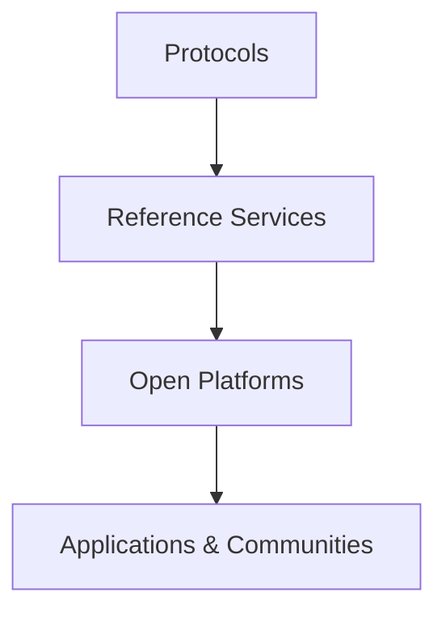
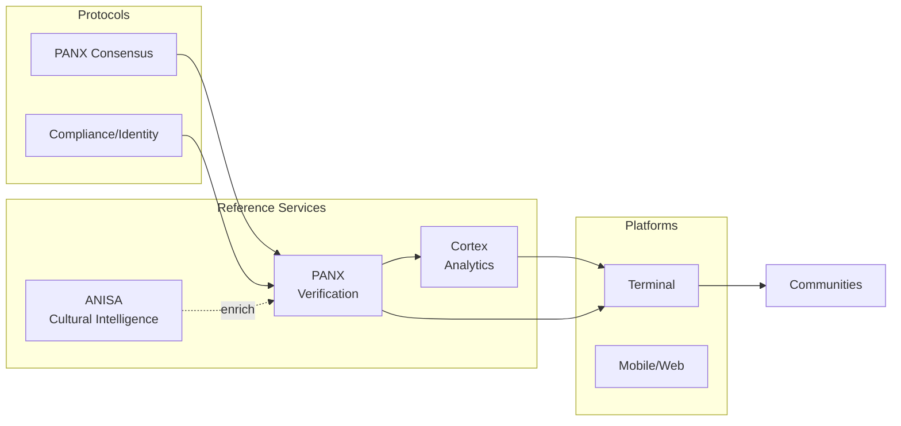

# GTCX Protocol Ecosystem

A public home for the GTCX protocols, reference services, and open‑source platforms.

Updated: 2025-09-02

## Why GTCX
GTCX is an open protocol stack for trustworthy global trade. It prioritizes verifiable events, culturally aware intelligence, and practical tools that work across regions, with a focus on the Global South.

## Protocols (foundation)
Canonical specifications live in the research repo:
- PANX Oracle Consensus — role‑weighted consensus, event‑type thresholds, auditable proofs
- Governance/Compliance/Identity — building blocks for compliant trade flows
- Transport & data contracts — JSON Schema with versioned `$id`

Key specs:
- PANX Oracle Consensus — https://github.com/gtcx-protocol/gtcx-ecosystem-research/tree/main/02-protocol-specifications/l1-core-protocols
- AGI / Authenticated Global Intelligence — https://github.com/gtcx-protocol/gtcx-ecosystem-research/tree/main/03-intelligence-systems

## Three‑tier architecture
1) Protocols — specifications and data contracts (research)
2) Reference services — PANX, ANISA, Cortex (services)
3) Platforms & apps — terminals, dashboards, integrations (platforms)

## Reference services (live)
- PANX (Oracle/Verification) — consensus, proofs, forward to Cortex
  - https://github.com/gtcx-protocol/gtcx-ecosystem-cognitive/tree/main/panx
- Cortex (Analytics) — ingest, summary, anomalies
  - https://github.com/gtcx-protocol/gtcx-ecosystem-cognitive/tree/main/cortex
- ANISA (Cultural Intelligence) — analyze/assess endpoints for enrichment
  - https://github.com/gtcx-protocol/gtcx-ecosystem-anisa

Each service includes: README, user/agent guides, runbooks, deploy guides, JSON Schemas, and changelogs.

## Open‑source platforms
- Platform UIs (terminal/dashboards) — https://github.com/gtcx-protocol/gtcx-ecosystem-platforms
- API gateway/adapters — https://github.com/gtcx-protocol/gtcx-ecosystem-api-gateway
- Research & specs — https://github.com/gtcx-protocol/gtcx-ecosystem-research

## Contracts and versioning
- JSON Schema with `$id` across services
- Response header `X-Contract-Version`
- Compatibility checks included (`contracts_compat_check.py` in cognitive repo)

## Quickstart
- PANX service — https://github.com/gtcx-protocol/gtcx-ecosystem-cognitive/tree/main/panx
- Cortex mock — https://github.com/gtcx-protocol/gtcx-ecosystem-cognitive/tree/main/cortex
- ANISA API — https://github.com/gtcx-protocol/gtcx-ecosystem-anisa

## Roadmap (high‑level)
- Protocol hardening and specification snapshots
- Schema‑first development with version guarantees
- Managed Postgres/Timescale persistence and retention
- Observability: metrics, dashboards, alerting
- Agentic behaviors: PANX (borderline re‑verify plans), Cortex (watchers & action proposals)

## Community
- Issues and discussions in each repo
- Contributions welcome: docs, code, research

MIT License
