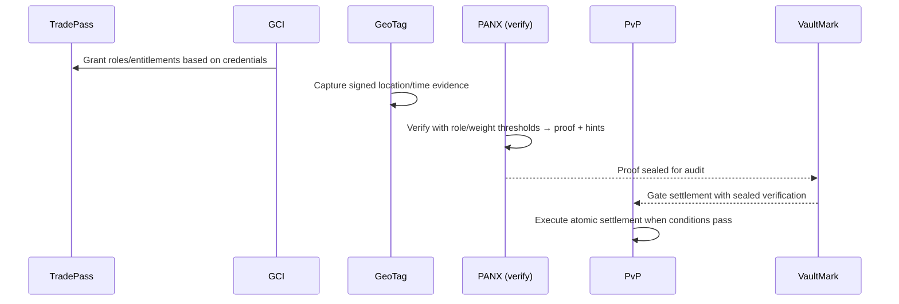

# GTCX Verification Layers (Layer‑1 Protocols)

Public home for GTCX’s core verification protocols and how they work independently and together.


Last updated: 2025‑09‑03

## Table of contents
- Executive summary
- Who this is for
- Problems we solve
- The five verification layers (deep dives)
- How they fit together (diagrams)
- Platforms mapping (CRX, SGX, AGX)
- Five flagship use cases
- Pilot in one week (checklist)
- Spec links
- FAQ
- Glossary
- Contributions & governance

> Start here: protocols index → `research/02-protocol-specifications/l1-core-protocols/` • platforms overview → `gtcx-ecosystem-platforms/README.md` • e2e demo (PANX↔Cortex) → `gtcx-ecosystem-cognitive/README.md`

---

## Executive summary
GTCX standardizes how facts are verified, approved, and preserved in global trade. Five core protocols (TradePass, GCI, GeoTag, VaultMark, PvP) produce sovereign, cryptographically verifiable artifacts. Platforms (CRX, SGX, AGX) consume these artifacts to automate permits, markets, and cross‑border settlement.

## Who this is for
- Governments and regulators seeking sovereignty‑preserving digital infrastructure
- Verified producers and cooperatives needing market access with trust guarantees
- Exchanges, vaults, and banks integrating proof‑based settlement
- Integrators and open‑source builders adopting a protocol‑first stack

## Problems we solve
- Who is allowed to do what? (access & roles)
- Who are the parties? Are they compliant? (identity & policy)
- Did a real event happen, where and when? (location & proofs)
- Can we settle safely across payment rails? (atomic settlement)
- Do we have tamper‑evident receipts for audit? (sealed records)

---

## The five verification layers (deep dives)

### 1) Identity & Authorization — TradePass
- What: roles, scopes, entitlements; who is allowed to act.
- Why: least‑privilege access, corridor rules, time‑boxed grants, transparent governance.
- Key ideas: DIDs/VCs, dynamic grants, role catalogs, reputation.
- Works independently: gate any API/UI or operational action.
- Composes with: GCI (grant by credentials), PANX (weights by role), PvP (initiate/approve permissions).
- Spec: https://github.com/gtcx-protocol/gtcx-ecosystem-research/blob/main/02-protocol-specifications/l1-core-protocols/tradepass-identity-specification.md

### 2) Compliance & Policy — GCI
- What: algorithmic compliance, attestations, policy checks, predictive risk.
- Why: make “who” and “which rules apply” transparent, consistent, and auditable.
- Key ideas: credential issuers, multi‑factor scoring, jurisdictional policies.
- Works independently: evaluate identity and compliance signals for any workflow.
- Composes with: TradePass (grant roles), PANX (validator classes/weights), PvP (regulatory gates).
- Spec: https://github.com/gtcx-protocol/gtcx-ecosystem-research/blob/main/02-protocol-specifications/l1-core-protocols/gci-compliance-intelligence.md

### 3) Evidence — GeoTag
- What: cryptographic location/provenance and timestamping with device attestation.
- Why: replace claims with proofs (where, when, with which device), prevent spoofing.
- Key ideas: multi‑constellation GPS, satellite correlation, HSM signatures, Merkle proofs.
- Works independently: trusted capture and verification of location/time context.
- Composes with: PANX (verify claims), VaultMark (seal evidence), GCI (region policies).
- Spec: https://github.com/gtcx-protocol/gtcx-ecosystem-research/blob/main/02-protocol-specifications/l1-core-protocols/geotag-location-verification.md

### 4) Audit — VaultMark
- What: sealed, tamper‑evident receipts and chain‑of‑custody.
- Why: preserve verification value end‑to‑end and prevent verification “washing.”
- Key ideas: physical‑digital binding (NFC/RFID), digital twins, immutable histories.
- Works independently: produce audit‑ready receipts for artifacts and custody events.
- Composes with: GeoTag (provenance), PANX (proof sealing), PvP (settlement receipts).
- Spec: https://github.com/gtcx-protocol/gtcx-ecosystem-research/blob/main/02-protocol-specifications/l1-core-protocols/vaultmark-custody-protocol.md

### 5) Settlement (post‑verification) — PvP
- What: coordinated, atomic settlement across rails; payment and delivery complete together or not at all.
- Why: eliminate counterparty risk and enforce verification by design.
- Key ideas: escrow/locks, programmable conditions, automatic reversal on failure.
- Works independently: risk‑free settlement engine; composes with proof/policy gates.
- Composes with: PANX (proof achieved), GCI (policy ok), VaultMark (sealed receipts).
- Spec: https://github.com/gtcx-protocol/gtcx-ecosystem-research/blob/main/02-protocol-specifications/l1-core-protocols/pvp-settlement-protocol.md

---

## How they fit together (diagrams)

### Protocols → Reference services → Platforms
```mermaid
flowchart LR
  subgraph "Verification Protocols"
    TP[TradePass]
    GCI[GCI]
    GT[GeoTag]
    VM[VaultMark]
    PVP[PvP]
  end
  subgraph "Reference Services"
    PANX[PANX (Verification)]
    ANISA[ANISA (Cultural)]
    CORTEX[Cortex (Analytics)]
  end
  subgraph "Platforms"
    CRX[CRX Regulatory]
    SGX[SGX Exchange]
    AGX[AGX Global]
  end
  TP --> PANX
  GCI --> PANX
  GT --> PANX
  VM --> PANX
  PVP --> PANX
  ANISA -. enrich .-> PANX
  PANX --> CORTEX
  PANX --> CRX
  PANX --> SGX
  PANX --> AGX
```

### End‑to‑end flow (plain English sequence)


### PvP settlement guardrails
```mermaid
flowchart TD
  A[Propose Settlement] --> B{TradePass Authorized?}
  B -- no --> X[Reject]
  B -- yes --> C{GCI Policy OK?}
  C -- no --> X
  C -- yes --> D{PANX Proof Achieved?}
  D -- no --> W[Wait/Retry or Abort]
  D -- yes --> E[Execute PvP Atomic Settlement]
  E --> F[Seal Receipts (VaultMark)]
  F --> G[Emit Analytics (Cortex)]
```

---

## Platforms mapping (CRX, SGX, AGX)
- CRX — government workflow automation & regulatory processing (permits, real‑time oversight, reporting)
- SGX — sovereign national exchange & settlement (price discovery, market making, government revenue capture)
- AGX
