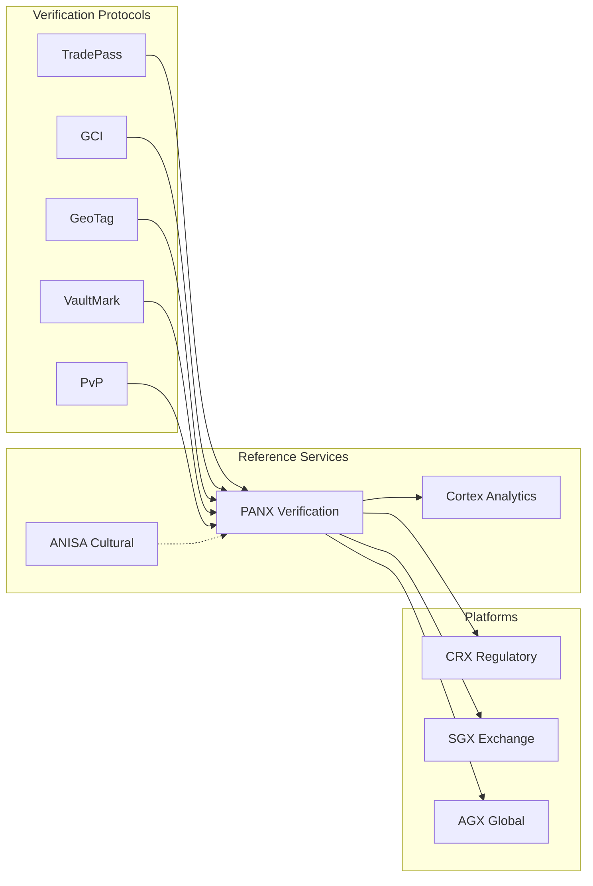
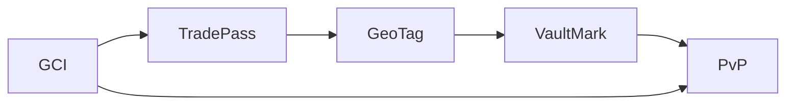
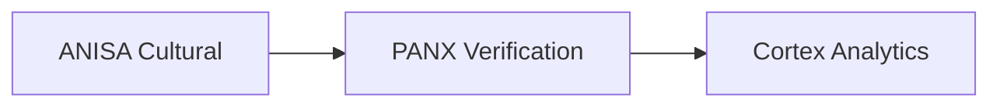
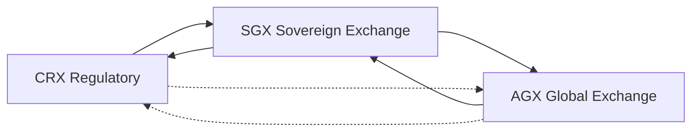
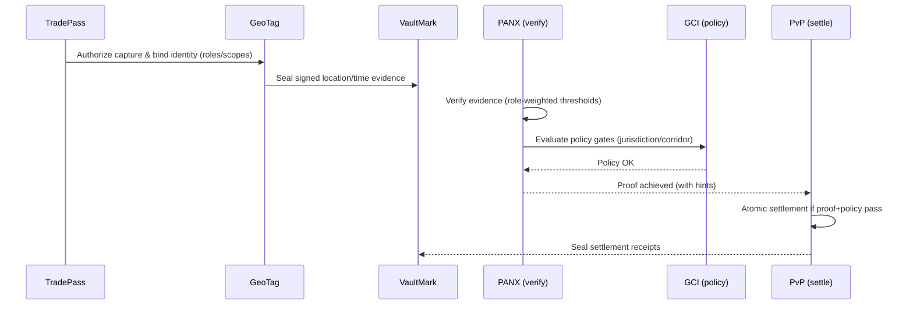

# GTCX Protocol Ecosystem

Public home for the GTCX verification protocols and sovereign platforms.

   

Last updated: 2025‑09‑03 06:50Z

## Table of contents
- Executive summary
- Who this is for
- Problems we solve
- Protocols (foundation) — deep dives
- Three‑tier architecture
- Open‑source platforms & tooling
- End‑to‑end data flow and visuals
- Five flagship use cases
- Pilot in one week (checklist)
- Spec links
- FAQ and Glossary
- Community & contributions

> Start here: protocols index → `research/02-protocol-specifications/l1-core-protocols/` • platforms overview → `gtcx-ecosystem-platforms/README.md` • e2e demo (PANX↔Cortex) → `gtcx-ecosystem-cognitive/README.md`

## Executive summary
GTCX standardizes how facts are verified, approved, and preserved in global trade. Five core protocols (TradePass, GCI, GeoTag, VaultMark, PvP) produce sovereign proofs that platforms (CRX, SGX, AGX) use to automate permits, markets, and cross‑border settlement.

## Who this is for
- Governments and regulators seeking sovereignty‑preserving digital infrastructure
- Verified producers and cooperatives needing market access with trust guarantees
- Exchanges, vaults, and banks integrating proof‑based settlement
- Integrators and open‑source builders adopting a protocol‑first stack

## Problems we solve
- Fragmented identity and inconsistent policy enforcement across jurisdictions
- Location/provenance fraud and unverifiable documentation
- Trust bottlenecks that slow approvals, trading, and settlement
- Audit gaps and verification “washing” through custody chains

## Protocols (foundation)
Core protocol specifications live in `gtcx-ecosystem-research/02-protocol-specifications/`.
- TradePass — identity & authorization (DIDs/VCs, roles, entitlements)
- GCI — compliance & policy (credentials, attestations, scoring)
- GeoTag — evidence (cryptographic location, timestamping, device attestation)
- VaultMark — audit (sealed receipts, custody chain)
- PvP — settlement (post‑verification, atomic payment‑versus‑physical)

Transport and data contracts use JSON Schema with versioned `$id`.

### The five protocols (deep dives)
- TradePass (Identity & Authorization): DIDs/VCs, role catalogs, time‑boxed grants, least‑privilege; composes with GCI and PANX weights
- GCI (Compliance & Policy): attestations, algorithmic scoring, jurisdictional policies, predictive risk; gates roles and settlement
- GeoTag (Evidence): multi‑constellation GPS, satellite correlation, HSM signatures, Merkle proofs; replaces claims with proofs
- VaultMark (Audit): physical‑digital binding (NFC/RFID), digital twins, immutable custody; prevents verification washing
- PvP (Settlement): atomic payment‑versus‑physical; settlement only when proof+policy pass

<!-- Removed high-level A→B→C diagram to reduce redundancy -->

### Spec links
- CRX/SGX Exchange Integration: `research/02-protocol-specifications/l3-exchange-layer/crx-sgx-exchange-integration.md`
- AGX (Authenticated Global Exchange): `research/02-protocol-specifications/l3-exchange-layer/agx-authenticated-global-exchange.md`

### Verification layers → platforms (visual)


## Five flagship use cases
- Permit issuance: GCI + TradePass + VaultMark; hours instead of weeks
- Depart/arrive verification: GeoTag + VaultMark → PANX proof; real‑time alerts
- Corridor policy enforcement: GCI + TradePass; transparent, consistent governance
- Milestone‑based payment: PANX proof → PvP + VaultMark; risk‑free release
- Dispute packet: VaultMark + GeoTag + GCI; complete sealed evidence

## Pilot in one week (checklist)
1) Site onboarding: issue TradePass, bind GeoTag devices, enable VaultMark
2) Capture: record depart/arrive events with signed evidence
3) Verify: PANX proof thresholds per event type
4) Govern: GCI policy gates; simulate corridor rules
5) Settle: dry‑run PvP release conditions
6) Report: sealed audit bundle + metrics

## FAQ
- Is PANX a protocol? No. PANX is a verification service that consumes protocol artifacts to produce network proofs.
- What’s sealed? Proofs, custody events, and artifacts via VaultMark.
- How do I pilot? Start with GeoTag + VaultMark at one site; add GCI/TradePass; then PANX; gate PvP last.

## Glossary
- Protocol — shared rulebook and data contracts
- Proof — evidence‑backed claim you can independently verify
- Seal — tamper‑evident record preserved for audit
- Atomic settlement — payment/delivery only complete together

## Three‑tier architecture
1) Protocols — specifications and data contracts (research repo)
2) Reference services — PANX, Cortex, ANISA (this org)
3) Platforms & apps — open‑source frontends, terminals, and integrations

#### Protocols layer

Protocols are composable, not strictly linear. TradePass authorizes capture, GeoTag produces signed evidence, VaultMark seals artifacts, and PvP gates settlement. GCI applies policies into both authorization and settlement.

#### Reference services layer

Reference services enrich, verify, and analyze protocol artifacts. ANISA adds cultural context; PANX turns evidence + policy into network proofs; Cortex aggregates and visualizes signals for operators.

#### Platforms layer

Platforms interoperate rather than strictly chain. CRX feeds sovereign approval/compliance into SGX; SGX returns market and custody events back to CRX. AGX connects multiple SGX instances to international buyers; limited CRX↔AGX links exist for export controls and revenue reporting.

## Reference services (live repos)
- PANX (Oracle/Verification): `gtcx-ecosystem-cognitive/panx` — consensus, proofs, forward to Cortex
- Cortex (Analytics): `gtcx-ecosystem-cognitive/cortex` — ingest, summary, anomalies
- ANISA (Cultural Intelligence): `gtcx-ecosystem-anisa` — analyze/assess endpoints for enrichment

Each service includes: README, user/agent guides, runbooks, deploy guides, JSON Schemas, and changelogs.

## Open‑source platforms & tooling
- CRX — government workflow automation & regulatory processing
- SGX — sovereign national exchange & settlement
- AGX — authenticated global exchange (international marketplace)
- Terminal & UI shells — operator dashboards and community views (repos under `gtcx-ecosystem-platforms/`)
- APIs & gateways — shared adapters and routing (`gtcx-ecosystem-api-gateway/`)
- Research & specs — canonical protocol drafts and design notes (`gtcx-ecosystem-research/`)

### End‑to‑end data flow
```mermaid
flowchart TD
  CRX[CRX Registration & Onboarding] --> TP[TradePass Identity Created]
  TP --> GT[GeoTag Site & Production Evidence]
  GT --> GCI[GCI Compliance Evaluation (Score)]
  GCI --> PANX[PANX Verification Greenlight]
  PANX --> SGX[SGX Export License / National Exchange]
  SGX --> AGX[AGX Authenticated Global Exchange]
  AGX --> PVP[PvP Cross‑Border Settlement]
  PVP --> VM[VaultMark Sealed Audit Records]
```

### End‑to‑end sequence (corrected order)


## Contracts and versioning
- JSON Schema with `$id` across services
- Response header `X-Contract-Version`
- Compatibility checks included in repos (`contracts_compat_check.py`)

## Deploy
- Quickstart (VM + Docker Compose) in PANX/Cortex/ANISA READMEs
- Helm charts & GKE Autopilot (planned)

## Roadmap (high‑level)
- Protocol hardening and specification snapshots
- Schema‑first development with version guarantees
- Managed Postgres/Timescale persistence and retention
- Observability: metrics, dashboards, and alerting
- Agentic behaviors: PANX (borderline re‑verify plans), Cortex (watchers & action proposals)

## Community
- Issues and discussions in each repo
- Contributions welcome: docs, code, research

MIT License

---

Contributions & governance: open issues/PRs against component repos; follow CHANGELOGs in each for release notes.
